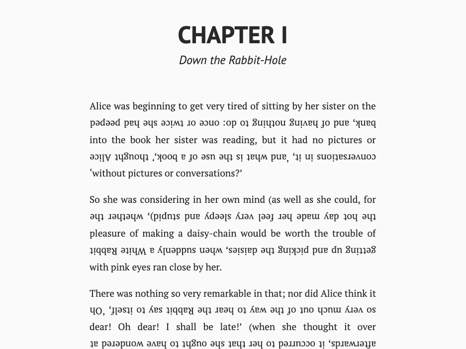

A Chrome extension to transform text into [boustrophedons](https://en.wikipedia.org/wiki/Boustrophedon).

*(Proof of concept [here](https://codepen.io/terryoshea/full/bZPaja) on Codepen)*

I use JS to break up paragraph text (whatever we can find in `
` tags) into
separate lines, then CSS to flip those lines and justify them properly on the
page. 

Sounds easy enough, but there is some tricky code to deal with hyphenated
words and embedded HTML tags like links, `<em>`s, and `<b>`s.
